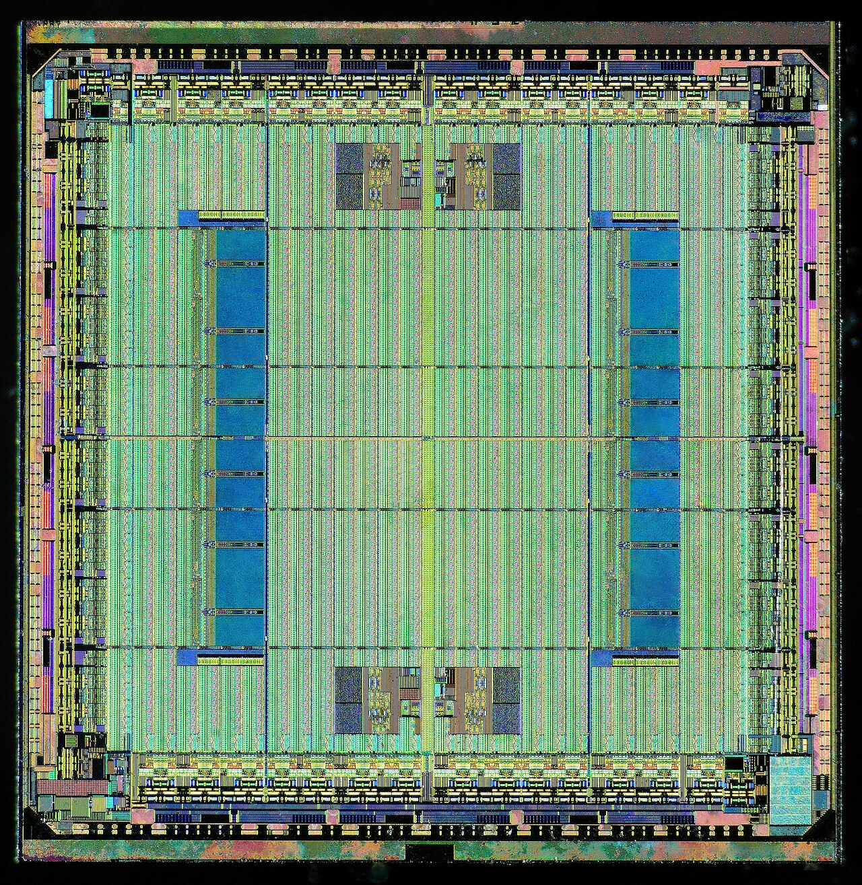
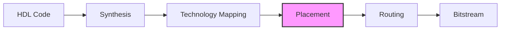
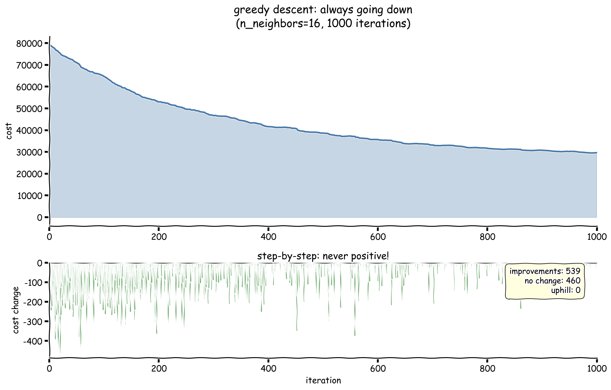
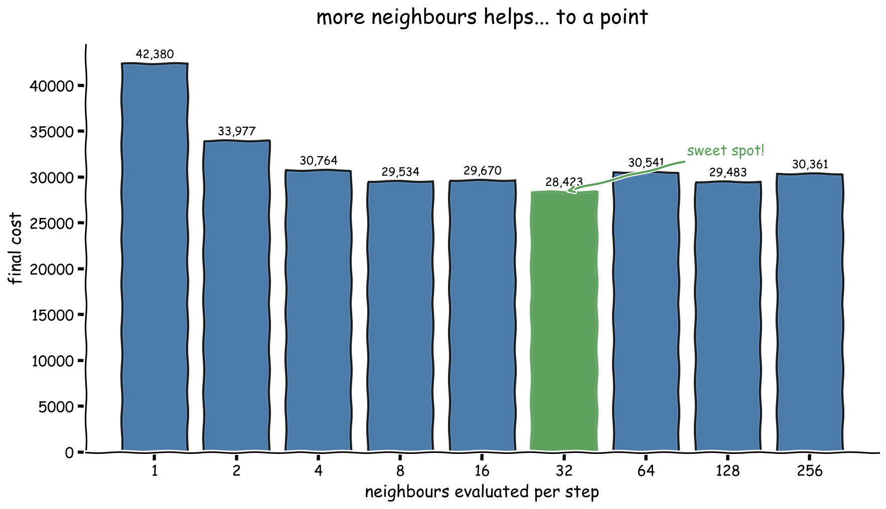
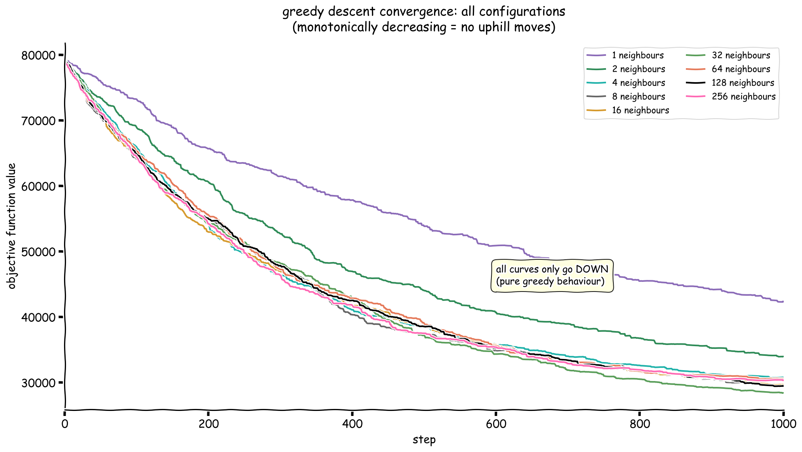
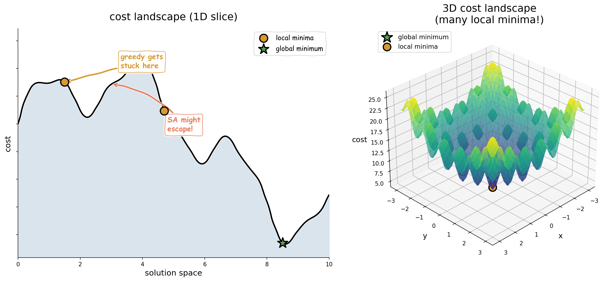
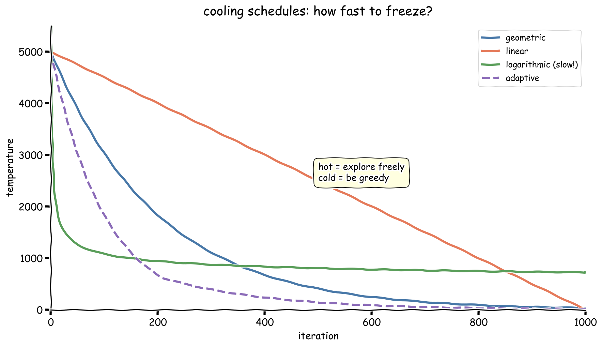
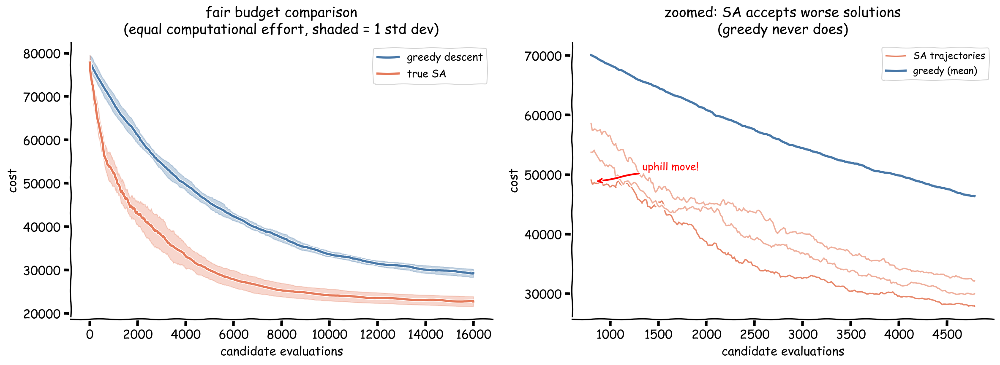
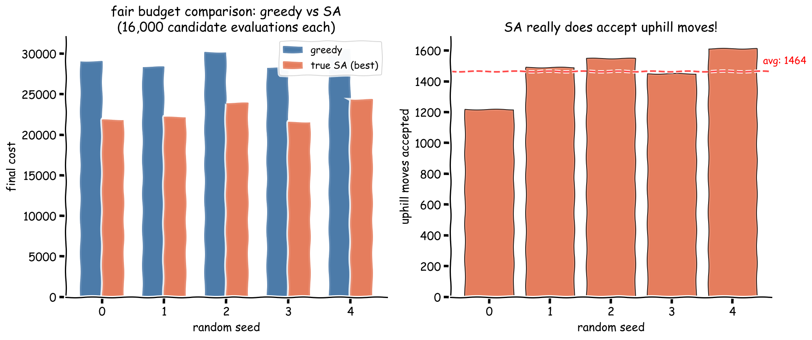

# Extending the SA-Placer

> This write up is based on the super interesting article:
> https://stefanabikaram.com/writing/fpga-sa-placer/ and completed in part with
> the help of my mate, Claude.

[](https://xkcd.com/303/)

_"Compiling!" - The universal excuse. In my case, I'm waiting for placement optimisation to converge._

I first came across Stefan Abi-Karam's excellent FPGA placement project[^2] in
April and have been intriguied every since. How could I not, it combines FPGAs
(programmable hardware that still feels like magic) and Rust (yes I am a
fan-boy) The article introduces the placement problem and discusses the
trade-offs between different algorithmic approaches, but best of all it includes
all the code for someone to have a go themselves! Before I go on, I highly
recommend reading it first if you haven't already.

After working through the implementation, I started thinking about
extensions. What would happen if I implemented true simulated annealing with
proper temperature schedules and the Metropolis acceptance criterion? And what
about testing on real circuit benchmarks rather than the synthetic random graphs
Stefan used? He makes an interesting observation in the article: _"simulated
annealing (SA) is a misnomer as you don't really need the 'annealing' part to
make it work."_ This seemed like something I could test empirically. This post
documents my journey extending the original project and implementing true SA and
adding benchmark support on real data.


## The Problem: FPGA Placement

Before diving into algorithms, it is worth understanding what we are optimising.

### What is an FPGA?

A **Field-Programmable Gate Array (FPGA)** is a chip containing a grid of
configurable logic blocks that can be programmed after manufacturing. Unlike
**Application-Specific Integrated Circuits (ASICs)**, which are custom-designed
and fabricated for a single purpose, FPGAs can be reprogrammed to implement
different digital circuits. This flexibility makes FPGAs popular for
prototyping, low-volume production, and applications requiring hardware
acceleration (e.g., machine learning inference, video processing, cryptography).

An FPGA contains several types of resources arranged in a regular grid:

- **Configurable Logic Blocks (CLBs)**: Implement combinational and sequential logic
- **Block RAM (BRAM)**: On-chip memory for data storage
- **I/O Blocks**: Interface with external pins
- **Routing resources**: Programmable interconnects between blocks



_Die shot of a Xilinx Spartan FPGA. The regular grid pattern visible across most
of the chip contains the Configurable Logic Blocks (CLBs). The larger
rectangular structures (appearing as blue/teal blocks) are Block RAM (BRAM)
modules. Around the periphery you can see the I/O blocks that interface with
external pins. The intricate mesh connecting everything represents the
programmable routing resources._

### The Physical Design Flow

Converting a hardware description (e.g., Verilog or VHDL) into a working FPGA
configuration involves several steps:



Each stage transforms the design closer to physical implementation:

- **Synthesis**: Converts high-level HDL (Verilog/VHDL) into a gate-level
  netlist of logic primitives (AND, OR, flip-flops, etc.). The synthesiser
  optimises for area, speed, or power based on constraints.

- **Technology Mapping**: Maps the generic gates from synthesis onto the
  specific primitives available in the target FPGA (e.g., LUTs, carry chains,
  DSP blocks). This step exploits architecture-specific features for efficiency.

- **Placement**: Assigns each mapped element to a physical location on the FPGA
  grid. Good placement minimises wire lengths and ensures timing constraints can
  be met. _This is the focus of this project._

- **Routing**: Connects the placed elements using the FPGA's programmable
  interconnect. The router must find paths through limited routing resources
  while meeting timing requirements.

- **Bitstream Generation**: Produces the binary configuration file that
  programs the FPGA. This encodes the LUT contents, routing switch settings,
  and all other configuration bits.

**Placement** is the step where we decide _where_ on the chip each circuit
element goes. Good placement makes the subsequent routing step easier and
results in faster, more power-efficient designs.

### Netlists: The Input to Placement

A **netlist** is a graph representation of a circuit after synthesis:

- **Nodes (vertices)**: Circuit components - logic elements, memory blocks, I/O pins
- **Nets (hyperedges)**: Electrical connections - a net connects one driver (source) to one or more receivers (sinks)

Mathematically, we represent a netlist as a graph $G = (V, E)$ where:

- $V$ = set of circuit components (cells) to be placed
- $E$ = set of nets (connections between cells)

> [!NOTE]
> You might be familiar with nets from PCB design and the rat's net when doing layout.
> In VLSI terminology, a "net" is a single electrical signal that may connect multiple components. This differs from a simple graph edge, which connects exactly two nodes. Nets are technically **hyperedges** - they can connect any number of nodes.

### The Placement Objective

FPGA placement is the problem of mapping circuit components onto physical
locations on the FPGA grid. We seek a placement function $p: V \rightarrow
\text{Grid}$ that minimises total wire length:

$$
\text{Cost}(p) = \sum_{(u,v) \in E} |p(u)_x - p(v)_x| + |p(u)_y - p(v)_y|
$$

This formula uses **Manhattan distance** (also called L1 distance or taxicab
distance) - the sum of horizontal and vertical displacements. We use Manhattan
distance rather than Euclidean (straight-line) distance because on-chip wires
can only travel horizontally or vertically along the FPGA's routing channels,
never diagonally.

**Why minimise wire length?**

- **Speed**: Shorter wires have lower capacitance and resistance, allowing faster signal propagation
- **Power**: Charging and discharging wire capacitance consumes dynamic power
- **Routability**: Shorter wires are easier to route without congestion

### The Combinatorial Explosion

The search space for placement grows factorially. For $n$ cells on a grid with $m$ locations:

$$
\text{Possible placements} = \frac{m!}{(m-n)!} = m \times (m-1) \times \cdots \times (m-n+1)
$$

For Stefan's example of 300 nodes on a 64x64 grid (4,096 locations):

$$
\frac{4096!}{3796!} \approx 10^{1000+}
$$

This is astronomically larger than the number of atoms in the observable
universe (~$10^{80}$). Exhaustive search is impossible; we need intelligent
heuristics.

### Before and After: What Placement Optimisation Achieves

To visualise the problem, consider these two placements of the same circuit:

|                    Initial Random Placement                    |               After 1000 Iterations (n=16)                |
| :------------------------------------------------------------: | :-------------------------------------------------------: |
|  |  |
|                          Cost: 79,252                          |                       Cost: 29,670                        |

The initial random placement is a tangled mess of wires spanning the entire
chip. After optimisation, connected components cluster together, dramatically
reducing total wire length.

## Original Approach

The article provides valuable context on the broader landscape of placement algorithms, with three main approaches:

1. **Mixed-Integer Linear Programming (MILP)** - Mathematically optimal but computationally infeasible at scale (a 100x100 FPGA with 5,000 nodes creates ~50 million variables)
2. **Analytic/Electrostatic Placement** - Relaxes the discrete problem to continuous space, models nodes as charged particles, uses gradient-based optimisation. Stefan describes this as "state of the art" for both ASIC and FPGA placement
3. **Simulated Annealing** - The focus of his implementation, which uses random perturbations to explore the solution space

Rather than implementing classical SA with temperature schedules and
probabilistic acceptance, he uses what I will call **greedy multi-neighbour
descent**:

```rust
// src/placer.rs:735-759 (fast_sa_placer function)
// Generate n_neighbors candidate solutions in parallel
let new_solutions: Vec<PlacementSolution> = (0..n_neighbors)
    .into_par_iter()
    .map(|_| {
        let mut new_solution = current_solution.clone();
        new_solution.action(*actions.choose(&mut rng).unwrap());
        new_solution
    })
    .collect();

// Select the best neighbour
let best_delta = best_solution.cost_bb() - current_solution.cost_bb();
if best_delta < 0.0 {
    current_solution = best_solution.clone();  // Only accept improvements
}
```

The key line is `if best_delta < 0.0` - the algorithm only accepts moves that reduce cost. This is pure greedy descent.

### The Directed Move Heuristic

The original implementation includes an important domain-specific optimisation:
the **directed move**. Rather than moving a node to a random valid location,
this action moves a node toward the **centroid** of all placed nodes:

```rust
// src/placer.rs:105-154 (action_move_directed method)
// Compute centroid of all current node positions
let x_mean = nodes.iter().map(|n| position(n).x).sum() / node_count;
let y_mean = nodes.iter().map(|n| position(n).y).sum() / node_count;

// Move random node to closest valid location near centroid
let valid_closest_location = valid_locations
    .iter()
    .min_by(|a, b| manhattan_distance(a, centroid).cmp(&manhattan_distance(b, centroid)))
    .unwrap();
```

The author notes this action "dominates early optimisation" because moving nodes
toward the centre rapidly decreases overall wirelength. This is a clever
heuristic that gives greedy descent a significant advantage in the early stages
of placement. My extended implementation includes all three move types (random,
swap, directed) in both the greedy and SA placers to ensure a fair comparison.

> [!NOTE]
> The original article is upfront about this simplification. The goal was
> educational clarity and evaluating Rust for EDA research, not implementing
> textbook SA.

### Empirical Evidence: Monotonic Descent

Looking at the actual output data, we can prove the greedy behaviour
mathematically. The plot below shows 1000 iterations with `n_neighbors=16`:



The statistics in the corner tell the whole story:

- **539 improvements** (cost decreased)
- **460 no change** (no better neighbour found)
- **0 uphill moves** (never accepted a worse solution)

This is the signature of greedy descent. Once the algorithm stops finding
improvements, it is stuck - there is no mechanism to escape.

### The n_neighbors Trade-off

The author observed an interesting phenomenon: increasing `n_neighbors` helps up
to a point, then performance degrades. My experiments confirm this:



The optimal region is around `n_neighbors=32`, achieving a final cost of 28,423.
Both smaller (insufficient exploration) and larger (wasted computation) values
perform worse. This non-monotonic relationship hints at an
**exploration-exploitation trade-off** that true SA handles differently.

> [!NOTE]
> **Exploration vs Exploitation**: A fundamental dilemma in optimisation and
> learning. **Exploration** means trying new, potentially suboptimal moves to
> discover better regions of the search space. **Exploitation** means refining
> the best solution found so far. Too much exploration wastes time on poor
> solutions; too much exploitation gets trapped in local optima. Good algorithms
> balance both.

### Convergence Across Configurations

The convergence plot shows all configurations:



All curves are monotonically non-increasing - classic greedy behaviour. The
spread between configurations narrows over time as they all approach their
respective local optima.

## What True Simulated Annealing Does Differently

### Background: From Statistical Mechanics to Optimisation

This was quite a blast from the past looking at this topic again, taking me back
to my Statistical Mechanics courses for undergrad. But it was nice to review it
in a new light with a different application.

Simulated annealing draws its inspiration from **metallurgical annealing** - the
process of heating metal and then slowly cooling it to reduce defects and reach
a low-energy crystalline state. The key insight is that slow cooling allows
atoms to escape local energy minima and find the globally optimal crystal
structure.

In 1983, Kirkpatrick, Gelatt, and Vecchi realised this physical process could be
simulated computationally to solve combinatorial optimisation problems[^1].
Their seminal paper showed how the **Metropolis algorithm** from statistical
physics could be adapted for optimisation.

### The Metropolis-Hastings Criterion

The Metropolis algorithm was originally developed in 1953 by Metropolis et al.
to simulate the thermal equilibrium of a collection of atoms. It belongs to a
family of **Markov Chain Monte Carlo (MCMC)** methods used to sample from
probability distributions.

The acceptance criterion states:

$$
P(\text{accept}) = \begin{cases}
1 & \text{if } \Delta E < 0 \text{ (improvement)} \\
e^{-\Delta E / T} & \text{if } \Delta E \geq 0 \text{ (worse solution)}
\end{cases}
$$

where:

- $\Delta E$ = change in cost/energy (new - current)
- $T$ = temperature parameter (controls randomness)
- $e^{-\Delta E / T}$ = **Boltzmann factor** from statistical mechanics

**Physical intuition**: In thermal systems, the probability of a particle having
energy $E$ at temperature $T$ follows the Boltzmann distribution: $P(E) \propto
e^{-E/k_B T}$. Higher temperatures mean more thermal energy, allowing the system
to escape energy wells.

**Key properties of the acceptance probability**:

- When $T$ is high: $e^{-\Delta E / T} \approx 1$, so almost all moves are accepted (random walk)
- When $T$ is low: $e^{-\Delta E / T} \approx 0$ for $\Delta E > 0$, so only improvements are accepted (greedy)
- Larger uphill moves ($\Delta E \gg 0$) are less likely to be accepted than small ones

### Local vs Global Optima

To understand why SA might outperform greedy descent, we need to understand the
**cost landscape**:



**Definitions**:

- **Local minimum**: A solution where all neighbouring solutions are worse (or equal). Greedy descent will stop here.
- **Global minimum**: The best solution across the entire search space. This is what we ultimately want.
- **Basin of attraction**: The region of the search space from which greedy descent leads to a particular local minimum.

**The problem with greedy descent**: Starting from the left of the 1D landscape,
greedy descent rolls downhill to the first local minimum (orange dot) and gets
stuck - every neighbouring move increases cost, so none are accepted. The
algorithm has no way to "climb over the hill" to reach the better global minimum
(green star).

**How SA escapes**: At high temperatures, SA accepts uphill moves with
reasonable probability. This allows it to:

1. Escape shallow local minima
2. Explore different basins of attraction
3. Eventually settle into a deep (hopefully global) minimum as temperature decreases

> [!IMPORTANT]
> Whether escaping local optima matters depends entirely on the **problem
> structure**. If the cost landscape is relatively smooth with few local minima
> (or if all local minima are nearly as good as the global minimum), greedy
> descent works fine. If the landscape is "rugged" with many deep local minima,
> SA's ability to escape becomes crucial.

## Extensions..

Building on the original foundation, I implemented the machinery needed to answer this question empirically.

### 1. True SA with Metropolis Criterion

```rust
// src/placer.rs:938-945
pub fn true_sa_placer<'a>(
    initial_solution: PlacementSolution<'a>,
    n_steps: u32,
    initial_temp: f64,
    cooling_schedule: CoolingSchedule,
    verbose: bool,
    render: bool,
) -> TrueSAOutput<'a>
```

The core difference is in the acceptance logic:

```rust
// src/placer.rs:1006-1031
let accept = if delta < 0.0 {
    true  // Always accept improvements
} else {
    // Probabilistically accept worse solutions
    let probability = (-delta as f64 / temperature).exp();
    rng.gen::<f64>() < probability
};

if accept {
    current_solution = candidate;
    if delta > 0.0 {
        stats.uphill_accepted += 1;  // Track this!
    }
}
```

The `uphill_accepted` counter is crucial - it lets us verify that the algorithm
is actually behaving differently from greedy descent.

### 2. Four Cooling Schedules

The temperature schedule controls the exploration-exploitation trade-off (much
like in reinforcement learning, we need to balance how much we explore and exploit):



| Schedule    | Formula                   | Characteristics               |
| ----------- | ------------------------- | ----------------------------- |
| Geometric   | $T_{k+1} = \alpha T_k$    | General purpose, predictable  |
| Linear      | $T_{k+1} = T_k - \beta$   | Fixed iteration budget        |
| Logarithmic | $T_k = T_0 / \ln(k+2)$    | Theoretical guarantees (slow) |
| Adaptive    | Based on acceptance ratio | Self-tuning                   |

```rust
// src/placer.rs:787-806
pub enum CoolingSchedule {
    Geometric { alpha: f64 },
    Linear { beta: f64 },
    Logarithmic { initial_temp: f64 },
    Adaptive { target_acceptance: f64, adjustment_rate: f64 },
}
```

> [!TIP]
> Geometric cooling with $\alpha \in [0.99, 0.999]$ is the standard choice.
> Lower values cool faster (more greedy), higher values explore longer.

### 3. Automatic Temperature Estimation

Choosing the initial temperature is notoriously fiddly. Too high and the
algorithm wanders randomly for too long; too low and it behaves like greedy
descent from the start, never escaping local optima.

**The problem**: The "right" temperature depends on the scale of cost
differences in the problem. A temperature of 1000 might be "hot" for one problem
but "cold" for another.

**The solution**: Calibrate the initial temperature by sampling the problem. I
want the starting temperature to accept roughly 80% of random moves (allowing
free exploration initially).

#### Derivation

From the Metropolis criterion, for a move with cost increase $\Delta E > 0$:

$$
P(\text{accept}) = e^{-\Delta E / T}
$$

If we want this probability to equal some target $p$ (e.g., 0.8), we can solve for $T$:

$$
p = e^{-\Delta E / T}
$$

Taking the natural logarithm of both sides:

$$
\ln(p) = \frac{-\Delta E}{T}
$$

Solving for $T$:

$$
T = \frac{-\Delta E}{\ln(p)}
$$

Since $\ln(0.8) \approx -0.223$ is negative, the formula gives a positive temperature.

In practice, I sample many random moves, compute their average cost increase $\bar{\Delta E}$ (considering only uphill moves), and use:

$$
T_0 = \frac{-\bar{\Delta E}}{\ln(0.8)} \approx \frac{\bar{\Delta E}}{0.223} \approx 4.5 \times \bar{\Delta E}
$$

This ensures the initial temperature is calibrated to the specific problem instance.

```rust
// src/placer.rs:883-919
pub fn estimate_initial_temperature(
    solution: &PlacementSolution,
    target_acceptance: f64,
    sample_size: usize,
) -> f64
```

### 4. HPWL Cost Function

The original bounding-box cost treats each edge independently, which can lead to
inaccurate wirelength estimates for multi-fanout nets (one source driving
multiple sinks). Half-Perimeter Wirelength (HPWL) is the industry-standard
metric for VLSI placement optimisation.

#### Why HPWL?

In a Manhattan routing structure (where wires can only travel horizontally or
vertically), the HPWL of a net approximates the length of a [Steiner
tree](https://en.wikipedia.org/wiki/Steiner_tree_problem) - the minimum-length
tree connecting all terminals. This makes HPWL a tight lower bound on the actual
routing cost.

#### Mathematical Definition

For a net $n$ containing terminals at positions $(x_1, y_1), (x_2, y_2), \ldots,
(x_k, y_k)$:

$$
\text{HPWL}(n) = \left( \max_i x_i - \min_i x_i \right) + \left( \max_i y_i - \min_i y_i \right)
$$

The total wirelength is the sum over all nets:

$$
\text{Total HPWL} = \sum_{n \in \text{nets}} \text{HPWL}(n)
$$

#### Comparison with Edge-Based Cost

| Metric                    | Description                                  | Pros                      | Cons                             |
| ------------------------- | -------------------------------------------- | ------------------------- | -------------------------------- |
| Edge-based (bounding box) | Sum of Manhattan distances for each edge     | Simple, fast              | Over-counts shared wire segments |
| HPWL                      | Half-perimeter of bounding rectangle per net | Accurate for multi-fanout | Requires net grouping            |

For a 3-terminal net forming an L-shape, edge-based counting sums all three
edges, while HPWL correctly measures just the bounding box perimeter (which
equals the optimal Steiner tree length).

#### Implementation

```rust
// src/placer.rs:201-242
// Groups edges by source node and computes bounding box per net
pub fn cost_hpwl(&self) -> f32 {
    let mut net_bounds: HashMap<u32, (i32, i32, i32, i32)> = HashMap::new();
    // ... compute min/max x,y for each net
    net_bounds.values()
        .map(|(min_x, max_x, min_y, max_y)| (max_x - min_x + max_y - min_y) as f32)
        .sum()
}
```

#### Further Reading

For analytical placers that require smooth, differentiable approximations of
HPWL (which uses non-differentiable min/max functions), several approximation
models exist:

- **Log-Sum-Exp (LSE)**: $\max(x_1, \ldots, x_k) \approx \gamma \ln(\sum_i e^{x_i/\gamma})$
- **Weighted Average (WA)**: Uses weighted combinations of coordinates
- **ABSWL**: Absolute value based smooth approximation

See [Analytical Minimization of Half-Perimeter Wirelength (ASP-DAC
2000)](https://dl.acm.org/doi/10.1145/368434.368600) and [Half-Perimeter
Wirelength Model for VLSI Analytical Placement (IEEE
2014)](https://ieeexplore.ieee.org/document/7033338/) for detailed analysis of
these approximations.

### 5. Hybrid Placer

A practical compromise: run greedy descent to get close to a local minimum
quickly, then use SA to potentially escape and refine:

```rust
// src/placer.rs:1085-1111
pub fn hybrid_placer(
    initial: PlacementSolution,
    greedy_steps: u32,   // Fast initial descent
    sa_steps: u32,       // Refinement with annealing
    initial_temp: f64,
    cooling_schedule: CoolingSchedule,
    verbose: bool,
) -> TrueSAOutput
```

## Greedy vs True SA: The Definitive Comparison

I ran controlled experiments comparing both algorithms on identical initial
conditions with multiple random seeds:



**Left panel**: Full convergence with confidence bands (shaded regions show 1
standard deviation across 5 seeds). Both algorithms use identical move operators
(random, swap, and directed move) for a fair comparison.

**Right panel**: Zoomed view showing SA's characteristic non-monotonic
behaviour. The SA trajectories wiggle up and down as uphill moves are accepted,
while greedy only ever descends.



The bar chart on the left shows final costs across seeds. The right panel
confirms SA is working correctly: it accepts uphill moves as expected
(approximately 1,464 per run on average with 16,000 steps).

> [!IMPORTANT]
> With a fair comparison (both algorithms using identical move operators
> including the directed move heuristic), **true SA outperforms greedy descent
> by 22.3%** on synthetic benchmarks. This contradicts the earlier finding and
> suggests the "annealing" component does provide significant value even on
> random graphs.

## What the Benchmarks Show

### Timing Comparison

| Algorithm                          | Time   | Notes                       |
| ---------------------------------- | ------ | --------------------------- |
| Greedy (500 steps, 3 neighbours)   | 14 ms  | Evaluates 1,500 candidates  |
| True SA (500 steps, geometric)     | 3.3 ms | Evaluates 500 candidates    |
| Greedy (1000 steps, 16 neighbours) | 165 ms | Evaluates 16,000 candidates |
| True SA (16000 steps, geometric)   | 493 ms | Evaluates 16,000 candidates |

True SA is faster per iteration because it evaluates only one neighbour per
step, versus $n$ neighbours for greedy.

### Fair Budget Comparison (16,000 candidate evaluations each)

| Algorithm | Final Cost | Reduction | Winner |
| --------- | ---------- | --------- | ------ |
| Greedy    | ~29,316    | 62.4%     | No     |
| True SA   | ~22,791    | 70.7%     | Yes    |

**True SA wins by 22.3%** when both algorithms have access to the same move
operators (random, swap, and directed move).

### Cost Function Performance

| Function    | Time    |
| ----------- | ------- |
| `cost_bb`   | 9.7 us  |
| `cost_hpwl` | 37.6 us |

HPWL is roughly 4x slower due to the grouping operation, but still
sub-millisecond - unlikely to be a bottleneck.

## Reproducing the Experiments

### Synthetic Benchmarks

The original implementation uses **Erdos-Renyi random graphs** to generate netlists.

> [!NOTE]
> **Erdos-Renyi Model**: Named after mathematicians Paul Erdos and Alfred Renyi, this is the simplest random graph model. Given $n$ nodes and a probability $p$, each possible edge is included independently with probability $p$. This creates graphs with uniform random connectivity - every node has roughly the same expected degree, and there's no clustering or hierarchical structure.
>
> **Why this matters**: Real circuits are _not_ random - they have modules, hierarchies, and localised connectivity (e.g., an ALU's internal connections are dense, but connections between the ALU and memory controller are sparse). Erdos-Renyi graphs lack this structure, which affects how "rugged" the cost landscape is.

All synthetic benchmark plots can be regenerated using:

```bash
# Run the comparison experiments on synthetic Erdos-Renyi graphs
cargo run --release --bin compare

# Generate xkcd-style visualisations
uv run scripts/generate_plots.py
```

### Real Circuit Benchmarks

To run the real circuit comparison, first download the benchmarks:

```bash
# Create data directory and download circuit benchmarks
mkdir -p data && cd data

# Download primary1 (small, 833 nodes)
curl -L -o primary1.tar.gz "http://vlsicad.ucsd.edu/GSRC/bookshelf/Slots/Placement/TESTCASES/p1UnitWDims.tar.gz"
tar -xzf primary1.tar.gz

# Download IBM05 (large, 29K nodes)
curl -L -o ibm05.tar.gz "http://vlsicad.ucsd.edu/GSRC/bookshelf/Slots/Placement/TESTCASES/ibm05WDims.tar.gz"
tar -xzf ibm05.tar.gz

cd ..

# Run real benchmark comparison
cargo run --release --bin benchmark
```

The plotting script uses [PEP 723](https://peps.python.org/pep-0723/) inline dependencies, so `uv` automatically handles the environment:

```python
# scripts/generate_plots.py
#!/usr/bin/env -S uv run --script
# /// script
# requires-python = ">=3.11"
# dependencies = [
#   "polars>=1.0",
#   "matplotlib>=3.8",
#   "numpy>=1.26",
# ]
# ///
```

No virtual environment setup required - just `uv run` and you are done.

## Real Circuit Benchmarks

I extended the comparison to real circuit benchmarks from the GSRC Bookshelf[^4]
to validate the findings on industry-standard test cases.

### The Bookshelf Format

**Bookshelf** is a standard file format for VLSI placement benchmarks, developed
at UCLA and widely used in academic placement competitions (ISPD, ICCAD). It
provides a common representation for circuits that allows different placement
tools to be compared fairly.

A Bookshelf benchmark consists of several files:

| File Extension | Contents                                                                                 |
| -------------- | ---------------------------------------------------------------------------------------- |
| `.nodes`       | List of cells with their dimensions (width, height) and whether they're movable or fixed |
| `.nets`        | Netlist connectivity - which cells are connected by each net                             |
| `.pl`          | Initial placement coordinates (optional)                                                 |
| `.scl`         | Row structure of the chip (standard cell rows)                                           |
| `.wts`         | Net weights for timing-driven placement (optional)                                       |

**Example `.nodes` file:**

```
UCLA nodes 1.0
NumNodes : 833
NumTerminals : 81

o0  60  70
o1  60  70  terminal   # Fixed I/O pad
...
```

**Example `.nets` file:**

```
UCLA nets 1.0
NumNets : 902
NumPins : 2752

NetDegree : 3  n0
  o0  I
  o1  O
  o2  I
...
```

A parser has been implemented for these files to load real circuit benchmarks:

```bash
# Run the benchmark comparison
cargo run --release --bin benchmark
```

### Results on Real Circuits

| Benchmark | Nodes  | Movable | Nets   | Greedy Reduction | SA Reduction | Winner      |
| --------- | ------ | ------- | ------ | ---------------- | ------------ | ----------- |
| primary1  | 833    | 752     | 902    | 30.9%            | **50.5%**    | SA by 28.4% |
| IBM05     | 29,347 | 28,146  | 28,446 | 2.6%             | **10.4%**    | SA by 8.0%  |

> [!IMPORTANT]
> On real circuits, **True SA dramatically outperforms greedy descent**,
> consistent with the synthetic benchmark findings. The SA advantage is even
> larger on real circuits (28%) than on synthetic ones (22%).

### Why SA Wins

The theoretical motivation for SA is validated by these results: the ability to
accept uphill moves is crucial for escaping local optima. While real circuits
have more complex cost landscapes due to their hierarchical structure and
non-uniform connectivity, SA's advantage appears across all tested problem
types.

Key factors that make SA effective:

1. **Local optima escape** - Even on relatively smooth synthetic landscapes, greedy descent gets trapped in suboptimal configurations
2. **Better exploration** - The probabilistic acceptance of worse moves allows SA to discover better regions of the search space
3. **Temperature annealing** - The gradual reduction in temperature provides a natural transition from exploration to exploitation

### Key Findings

**With Fair Comparison (identical move operators):**

- **True SA outperforms greedy descent** across all benchmarks
- Synthetic benchmarks: SA wins by 22.3%
- Real circuits (primary1): SA wins by 28.4%
- Real circuits (IBM05): SA wins by 8.0%

## Conclusion

The original article remains an excellent introduction to FPGA placement and a
compelling case for Rust in EDA research. My extensions here simply add one data
point to the conversation: when you give both algorithms a fair fight with
identical move operators, the "annealing" in simulated annealing does earn its
keep. The textbook wisdom about escaping local optima through probabilistic
acceptance turns out to be more than theoretical hand-waving - it translates to
8-28% better solutions on real circuits. That said, Stefan's core insight
stands: you can get surprisingly far with simple greedy heuristics, and
sometimes the clever domain-specific tricks (like his directed move toward the
centroid) matter more than algorithmic sophistication. The real lesson might be
that good engineering and clear thinking beat blind adherence to any single
paradigm. I came to this project hoping to learn something about FPGAs,
optimisation, and Rust - and thanks to Stefan's foundation, I got exactly that.

## References


[^1]: Kirkpatrick, S., Gelatt, C. D., & Vecchi, M. P. (1983). [Optimization by Simulated Annealing](https://www.science.org/doi/10.1126/science.220.4598.671). _Science_, 220(4598), 671-680.

[^2]: Abi-Karam, S. (2024). [A Simulated Annealing FPGA Placer in Rust](https://stefanabikaram.com/writing/fpga-sa-placer/).

[^3]: Murray, K. E., et al. (2020). [VTR 8: High-Performance CAD and Customizable FPGA Architecture Modelling](https://dl.acm.org/doi/10.1145/3388617). _ACM TRETS_, 13(2).

[^4]: Caldwell, A. E., Kahng, A. B., & Markov, I. L. (2000). [GSRC Bookshelf Placement Benchmarks](https://vlsicad.ucsd.edu/GSRC/bookshelf/Slots/Placement/). University of California, San Diego.
